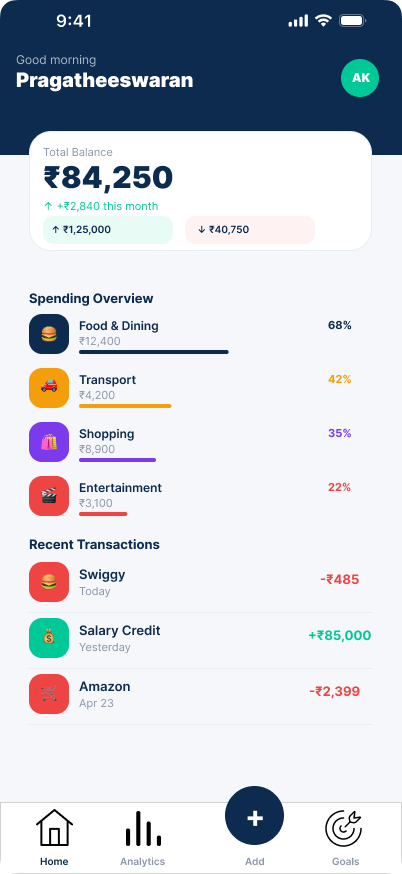

# BudgetBee - Finance Tracker App 💰

## 📌 Overview
BudgetBee is a UI/UX design project for a personal finance tracking mobile application designed using Figma. The goal is to help users manage their income, expenses, and savings effectively.

## ❗ Problem
Many users struggle to track their daily expenses and manage their finances efficiently due to complex or confusing interfaces in existing apps.

## 💡 Solution
Designed a simple and intuitive interface that allows users to easily track income and expenses, view insights, and manage budgets.

## 🔄 User Flow
User opens app → adds income/expense → categorizes transaction → views dashboard → tracks spending

## 🎨 Design Process
- User Research
- Wireframing
- UI Design in Figma
- Prototyping

## ✨ Features
- Income & expense tracking
- Category-wise spending
- Dashboard overview
- Simple and clean UI

## 🛠 Tools Used
- Figma

## 🔗 Figma Design
https://www.figma.com/design/Aa60OH9ISbsb7fnf40vQtu/budget-app?node-id=0-1&t=4zcH1hdNaKn6eW1h-0
